# Основные потоки данных

Поток данных о регистрации пользователя:
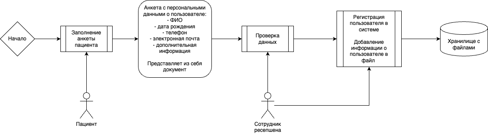

Поток данных о записи к врачу:
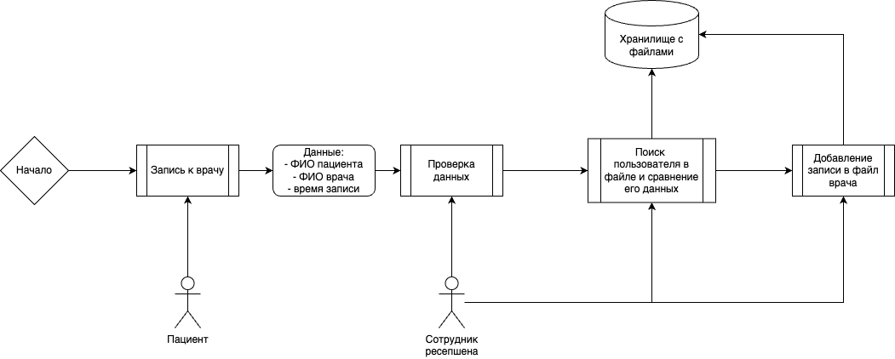

Поток данных о добавлении данных пациента:
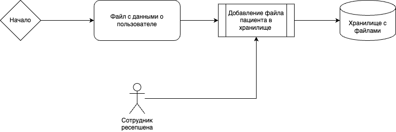

Поток данных о работе врача:
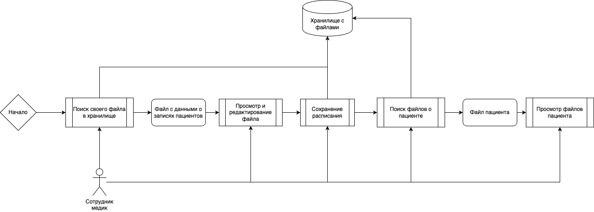

Поток данных об оплате:
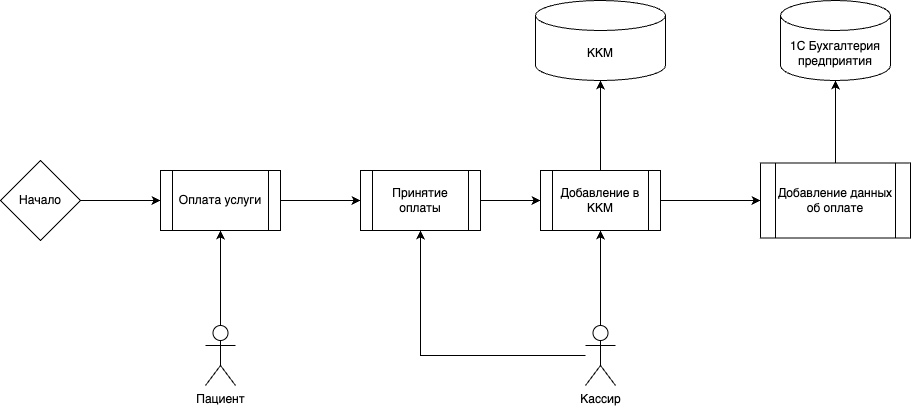

Поток данных об аналитике:
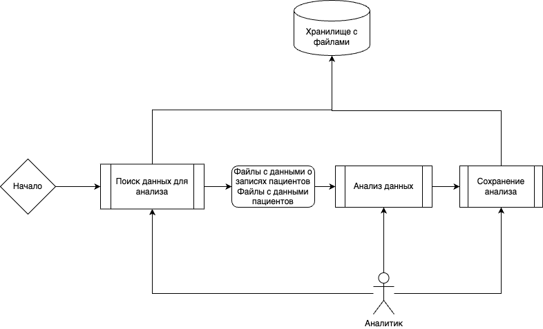

Имеется персональная информация о пациенте:
- ФИО
- дата рождения
- телефон
- электронная почта

# Проблемные зоны

Основные проблемные зона заключаются:
1. Сотрудник ресепшена может просматривать персональные данные всех пользователей;
2. Сотрудник ресепшена может просматривать все записи к врачам;
3. Врач может просматривать персональные данные всех пользователей;
4. Редактировать данные могут все, у кого есть доступ к файловой системе;
5. Файловое хранилище и файловая система не разделены между собой;
6. Просматривать файлы пользователей могут все;
7. Нет аудитных логов, кто что просматривал и делал в системах.

# Улучшения

Основные улучшения:
1. Разделить доступы между файловым хранилищем и файловой системой;
2. Добавить аудит логи для доступам к файлам;
3. Добавить механизм шифрования для файлов в файловом хранилище;
4. Добавить теги PII на файлы с персональной информацией о пациентах и на файлы, которые связаны с ними;
5. Для аналитики добавить механизм выгрузки данных через использование механизма обфускации, а именно токенезации на основе тегов PII;
6. Для расшифровки файлов пользователей использовать ABAC, который будет давать доступ к ним на основе атрибутов:
    - лечащий врач - нахождение в списке врача;
    - администратор - рабочая смена;
7. Для расшифровки файлов с расписанием врача использовать ABAC, который будет давать доступ к ним на основе атрибутов:
    - лечащий врач - принадлежность;
    - администратор - рабочая смена;

## Доработанные схемы потоков данных

Поток данных о регистрации пользователя:
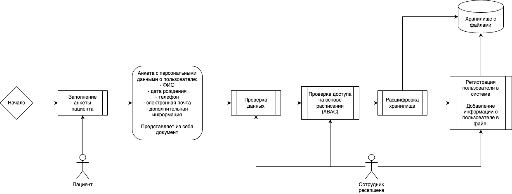

Поток данных о записи к врачу:
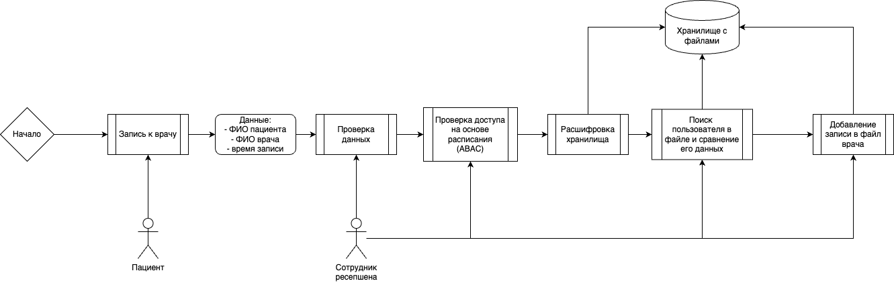

Поток данных о добавлении данных пациента:
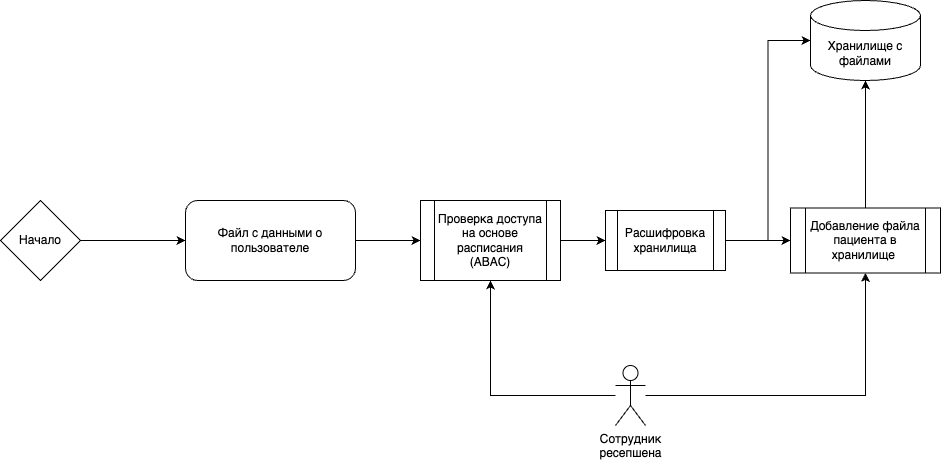

Поток данных о работе врача:
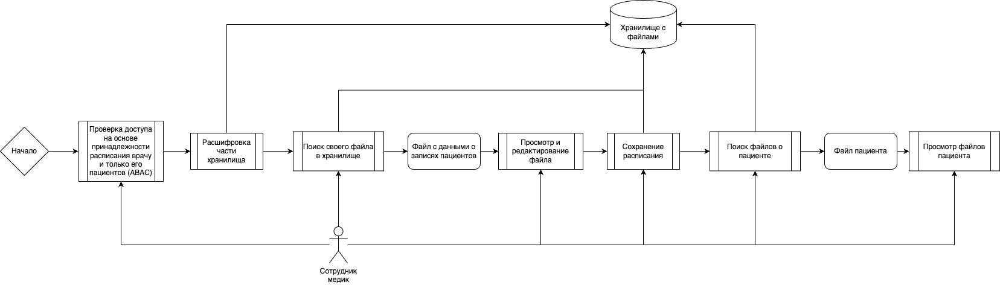

Поток данных об аналитике:
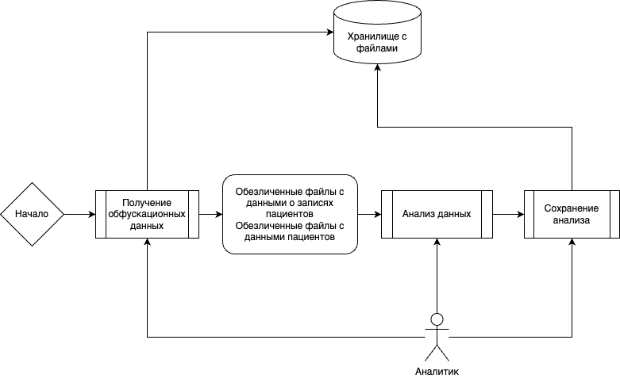
